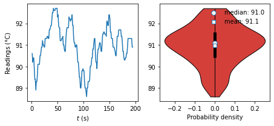

# LCD-Machine-Learning-OTR
> Use deep learning to recognise of liquid crystal display readings

## Train the text recognition model using <u>deep-text-recognition</u> ([github link](https://github.com/clovaai/deep-text-recognition-benchmark))
### Different settings and models were used to achieve best acuracy. The arguments are listed as follow:<br>
---
**Basic settings:**

|Command|help|Input|
|:---:|:---:|:---:|
|--exp_name|Where to store logs and models|Directory to store trained model|
|--train_data|required=True, path to training dataset|Directory of training dataset|
|--valid_data|required=True, path to validation dataset|Directory of training dataset|
|--manualSeed|type=int, default=1111|for random seed setting|
|--workers|type=int, number of data loading workers, default=4|int|
|--batch_size|type=int, default=192|input batch size|
|--num_iter|type=int, default=300000|number of iterations to train for|
|--valInterval|type=int, default=2000, Interval between each validation|int|
|--saved_model|default='', path of model to continue training|Directory|
|--FT|action='store_true', whether to do fine-tuning|No input, activates by include this argument|
|--adam|action='store_true', Whether to use adam (default is Adadelta)|No input|
|--lr|type=float, default=1, learning rate, default=1.0 for Adadelta|float|
|--beta1|type=float, default=0.9, beta1 for adam. default=0.9|float|
|--rho|type=float, default=0.95, decay rate rho for Adadelta. default=0.95|float|
|--eps|type=float, default=1e-8, eps for Adadelta. default=1e-8|float|
|--grad_clip| type=float, default=5, gradient clipping value. default=5|float|
|--baiduCTC| action='store_true', for data_filtering_off mode|No input|

---
**Data processing:**

|Command|help|Input|
|:---:|:---:|:---:|
|--select_data| type=str, default='MJ-ST', select training data (default is MJ-ST, which means MJ and ST used as training data|For use sample data|
|--batch_ratio| type=str, default='0.5-0.5', assign ratio for each selected data in the batch|Use with MJ-ST|
|--total_data_usage_ratio| type=str, default='1.0', total data usage ratio, this ratio is multiplied to total number of data.|For use part of data|
|--batch_max_length| type=int, default=25, maximum-label-length| |
|--imgH| type=int, default=32, the height of the input image|image size|
|--imgW| type=int, default=100, the width of the input image|image size|
|--rgb| action='store_true', use rgb input'|No input|
|--character| type=str, default='0123456789abcdefghijklmnopqrstuvwxyz', character label|To add or fileter symbols, characters|
|--sensitive| action='store_true', for sensitive character mode|Use this to recognise Upper case|
|--PAD| action='store_true', whether to keep ratio then pad for image resize| |
|--data_filtering_off| action='store_true', for data_filtering_off mode|No input|

---
**Model Architecture:**

|Command|help|Input|
|:---:|:---:|:---:|
|--Transformation| type=str, required=True, Transformation stage. |None or TPS|
|--FeatureExtraction| type=str, required=True, FeatureExtraction stage. |VGG, RCNN or ResNet|
|--SequenceModeling| type=str, required=True, SequenceModeling stage. |None or BiLSTM|
|--Prediction| type=str, required=True, Prediction stage. |CTC or Attn|
|--num_fiducial| type=int, default=20, number of fiducial points of TPS-STN|int|
|--input_channel| type=int, default=1, the number of input channel of Feature extractor|int|
|--output_channel| type=int, default=512, the number of output channel of Feature extractor|int|
|--hidden_size| type=int, default=256, the size of the LSTM hidden state|int|

### Train the models
The variables used will be:

|Model|Experiment Name|Command used|
|:---:|:---:|:---:|
|VGG | vgg-notran-nolstm-ctc | CUDA_VISIBLE_DEVICES=0 python3 train.py --exp_name vgg-notran-nolstm-ctc \ --train_data result/train --valid_data result/test --batch_size 200 \ --Transformation None --FeatureExtraction VGG --SequenceModeling None --Prediction CTC \ --num_iter 10000 --valInterval 1000 |
|VGG | vgg-tps-nolstm-ctc| CUDA_VISIBLE_DEVICES=0 python3 train.py --exp_name vgg-tps-nolstm-ctc \ --train_data result/train --valid_data result/test --batch_size 200 \ --Transformation TPS --FeatureExtraction VGG --SequenceModeling None --Prediction CTC \ --num_iter 10000 --valInterval 1000 |
|VGG |vgg-notran-nolstm-attn|CUDA_VISIBLE_DEVICES=0 python3 train.py --exp_name vgg-notran-nolstm-attn \ --train_data result/train --valid_data result/test --batch_size 200 \ --Transformation None --FeatureExtraction VGG --SequenceModeling None --Prediction Attn \ --num_iter 10000 --valInterval 1000|
|RCNN | rcnn-notran-nolstm-ctc | CUDA_VISIBLE_DEVICES=0 python3 train.py --exp_name rcnn-notran-nolstm-ctc \ --train_data result/train --valid_data result/test --batch_size 200 \ --Transformation None --FeatureExtraction RCNN --SequenceModeling None --Prediction CTC \ --num_iter 10000 --valInterval 1000 |
|RCNN | rcnn-notran-nolstm-atnn | CUDA_VISIBLE_DEVICES=0 python3 train.py --exp_name rcnn-notran-nolstm-atnn \ --train_data result/train --valid_data result/test --batch_size 200 \ --Transformation None --FeatureExtraction RCNN --SequenceModeling None --Prediction Attn \ --num_iter 10000 --valInterval 1000 |
|ResNet | resnet-notran-nolstm-ctc | CUDA_VISIBLE_DEVICES=0 python3 train.py --exp_name resnet-notran-nolstm-ctc \ --train_data result/train --valid_data result/test --batch_size 200 \ --Transformation None --FeatureExtraction ResNet --SequenceModeling None --Prediction CTC \ --num_iter 10000 --valInterval 1000 |
|ResNet | resnet-notran-nolstm-atnn | CUDA_VISIBLE_DEVICES=0 python3 train.py --exp_name resnet-notran-nolstm-atnn \ --train_data result/train --valid_data result/test --batch_size 200 \ --Transformation None --FeatureExtraction ResNet --SequenceModeling None --Prediction Attn \ --num_iter 10000 --valInterval 1000 |

### Experiment checklist


```python
from IPython.display import display
from ipywidgets import Checkbox

box1 = Checkbox(False, description='vgg-notran-nolstm-ctc')
box2 = Checkbox(False, description='vgg-notran-nolstm-attn')
box3 = Checkbox(False, description='rcnn-notran-nolstm-ctc')
box4 = Checkbox(False, description='rcnn-notran-nolstm-atnn')
box5 = Checkbox(False, description='resnet-notran-nolstm-ctc')
box6 = Checkbox(False, description='resnet-notran-nolstm-atnn')
display(box1,box2,box3,box4,box5,box6)

def changed(b):
    print(b)

box1.observe(changed)
box2.observe(changed)
box3.observe(changed)
box4.observe(changed)
box5.observe(changed)
box6.observe(changed)
```


    Checkbox(value=False, description='vgg-notran-nolstm-ctc')


    Checkbox(value=False, description='vgg-notran-nolstm-attn')


    Checkbox(value=False, description='rcnn-notran-nolstm-ctc')


    Checkbox(value=False, description='rcnn-notran-nolstm-atnn')


    Checkbox(value=False, description='resnet-notran-nolstm-ctc')


    Checkbox(value=False, description='resnet-notran-nolstm-atnn')


### Experiment summary
By using ResNet (no Transformation, no BiLTSM) with ctc prediction, an prediction accuracy of over 98 % was achieved.

|Model|Exp Name|Accuracy|
|:---:|:---:|:---:|
|VGG | vgg-notran-nolstm-ctc |90.837|
|VGG | vgg-tps-nolstm-ctc|64.542|
|VGG |vgg-notran-nolstm-attn|86.853|
|RCNN | rcnn-notran-nolstm-ctc |80.080|
|RCNN | rcnn-notran-nolstm-atnn | - |
|ResNet | resnet-notran-nolstm-ctc |<mark>98.805</mark>|
|ResNet | resnet-notran-nolstm-atnn |94.422|

Command to train ResNet with a batch size of 50:

```
!CUDA_VISIBLE_DEVICES=0 python3 train.py --exp_name resnet-notran-nolstm-ctc-bs50 \
--train_data result/train --valid_data result/test --batch_size 50 \
--Transformation None --FeatureExtraction ResNet --SequenceModeling None --Prediction CTC \
--num_iter 10000 --valInterval 1000 \
--saved_model saved_models/resnet-notran-nolstm-ctc/best_accuracy.pth
```

### Predict readings from trained model


```python
%cd /mnt/c/Users/stcik/scire/papers/muon/deep-text-recognition-benchmark
```

    /mnt/c/Users/stcik/scire/papers/muon/deep-text-recognition-benchmark
    


```python
# Predict 90C data
output = !python3 predict.py \
--Transformation None --FeatureExtraction ResNet --SequenceModeling None --Prediction CTC \
--image_folder 90C/ --batch_size 400 \
--saved_model resnet-notran-nolstm-ctc-50bs.pth
```


```python
output
```


    ['No Transformation module specified',
     'No SequenceModeling module specified',
     'model input parameters 32 100 20 1 512 256 12 25 None ResNet None CTC',
     'loading pretrained model from resnet-notran-nolstm-ctc-50bs.pth',
     '--------------------------------------------------------------------------------',
     'image_path               \tpredicted_labels         \tconfidence score',
     '--------------------------------------------------------------------------------',
     '90C/90C_00001.jpg        \t90.6                     \t0.9260',
     '90C/90C_00002.jpg        \t90.2                     \t0.4132',
     '90C/90C_00003.jpg        \t90.4                     \t0.4597',
     '90C/90C_00004.jpg        \t90.4                     \t0.6889',
     '90C/90C_00005.jpg        \t89.9                     \t0.8157',
     '90C/90C_00006.jpg        \t89.4                     \t0.8915',
     '90C/90C_00007.jpg        \t89.4                     \t0.8893',
     '90C/90C_00008.jpg        \t88.9                     \t0.6254',
     '90C/90C_00009.jpg        \t89.3                     \t0.7556',
     '90C/90C_00010.jpg        \t89.3                     \t0.8855',
     '90C/90C_00011.jpg        \t89.6                     \t0.9454',
     '90C/90C_00012.jpg        \t90.1                     \t0.8667',
     '90C/90C_00013.jpg        \t90.1                     \t0.9133',
     '90C/90C_00014.jpg        \t90.1                     \t0.6727',
     '90C/90C_00015.jpg        \t90.1                     \t0.6812',
     '90C/90C_00016.jpg        \t90.5                     \t0.9786',
     '90C/90C_00017.jpg        \t90.5                     \t0.9531',
     '90C/90C_00018.jpg        \t90.7                     \t0.3823',
     '90C/90C_00019.jpg        \t90.9                     \t0.9684',
     '90C/90C_00020.jpg        \t90.9                     \t0.7335',
     '90C/90C_00021.jpg        \t91.2                     \t0.9164',
     '90C/90C_00022.jpg        \t91.0                     \t0.8443',
     '90C/90C_00023.jpg        \t91.0                     \t0.6517',
     '90C/90C_00024.jpg        \t90.9                     \t0.8406',
     '90C/90C_00025.jpg        \t90.9                     \t0.9026',
     '90C/90C_00026.jpg        \t91.3                     \t0.9660',
     '90C/90C_00027.jpg        \t91.3                     \t0.9560',
     '90C/90C_00028.jpg        \t91.3                     \t0.9541',
     '90C/90C_00029.jpg        \t91.3                     \t0.9802',
     '90C/90C_00030.jpg        \t91.4                     \t0.9155',
     '90C/90C_00031.jpg        \t91.4                     \t0.5502',
     '90C/90C_00032.jpg        \t91.3                     \t0.9826',
     '90C/90C_00033.jpg        \t91.3                     \t0.9797',
     '90C/90C_00034.jpg        \t91.7                     \t0.8735',
     '90C/90C_00035.jpg        \t91.7                     \t0.5008',
     '90C/90C_00036.jpg        \t91.8                     \t0.7482',
     '90C/90C_00037.jpg        \t91.9                     \t0.9304',
     '90C/90C_00038.jpg        \t91.9                     \t0.9529',
     '90C/90C_00039.jpg        \t92.2                     \t0.7149',
     '90C/90C_00040.jpg        \t92.5                     \t0.9451',
     '90C/90C_00041.jpg        \t92.5                     \t0.8780',
     '90C/90C_00042.jpg        \t92.7                     \t0.3061',
     '90C/90C_00043.jpg        \t92.6                     \t0.8581',
     '90C/90C_00044.jpg        \t92.6                     \t0.7194',
     '90C/90C_00045.jpg        \t92.6                     \t0.8231',
     '90C/90C_00046.jpg        \t92.7                     \t0.3484',
     '90C/90C_00047.jpg        \t92.7                     \t0.4737',
     '90C/90C_00048.jpg        \t92.7                     \t0.4586',
     '90C/90C_00049.jpg        \t92.7                     \t0.2290',
     '90C/90C_00050.jpg        \t92.3                     \t0.5724',
     '90C/90C_00051.jpg        \t92.4                     \t0.4780',
     '90C/90C_00052.jpg        \t91.9                     \t0.7439',
     '90C/90C_00053.jpg        \t91.8                     \t0.8034',
     '90C/90C_00054.jpg        \t91.8                     \t0.7639',
     '90C/90C_00055.jpg        \t91.2                     \t0.7996',
     '90C/90C_00056.jpg        \t91.2                     \t0.8184',
     '90C/90C_00057.jpg        \t91.2                     \t0.9601',
     '90C/90C_00058.jpg        \t91.3                     \t0.9830',
     '90C/90C_00059.jpg        \t91.3                     \t0.8894',
     '90C/90C_00060.jpg        \t91.4                     \t0.8435',
     '90C/90C_00061.jpg        \t91.0                     \t0.9166',
     '90C/90C_00062.jpg        \t91.0                     \t0.8326',
     '90C/90C_00063.jpg        \t90.8                     \t0.5681',
     '90C/90C_00064.jpg        \t90.7                     \t0.4979',
     '90C/90C_00065.jpg        \t90.7                     \t0.4035',
     '90C/90C_00066.jpg        \t91.3                     \t0.9836',
     '90C/90C_00067.jpg        \t91.6                     \t0.9806',
     '90C/90C_00068.jpg        \t91.8                     \t0.6559',
     '90C/90C_00069.jpg        \t91.8                     \t0.8275',
     '90C/90C_00070.jpg        \t91.8                     \t0.8524',
     '90C/90C_00071.jpg        \t91.8                     \t0.8793',
     '90C/90C_00072.jpg        \t92.3                     \t0.5861',
     '90C/90C_00073.jpg        \t92.2                     \t0.2892',
     '90C/90C_00074.jpg        \t92.2                     \t0.3812',
     '90C/90C_00075.jpg        \t92.1                     \t0.7446',
     '90C/90C_00076.jpg        \t92.2                     \t0.4035',
     '90C/90C_00077.jpg        \t92.2                     \t0.7735',
     '90C/90C_00078.jpg        \t92.4                     \t0.4041',
     '90C/90C_00079.jpg        \t91.9                     \t0.4874',
     '90C/90C_00080.jpg        \t91.9                     \t0.6911',
     '90C/90C_00081.jpg        \t91.3                     \t0.9602',
     '90C/90C_00082.jpg        \t91.1                     \t0.9683',
     '90C/90C_00083.jpg        \t91.1                     \t0.8846',
     '90C/90C_00084.jpg        \t90.9                     \t0.7075',
     '90C/90C_00085.jpg        \t90.9                     \t0.8356',
     '90C/90C_00086.jpg        \t91.0                     \t0.8974',
     '90C/90C_00087.jpg        \t91.0                     \t0.6161',
     '90C/90C_00088.jpg        \t90.6                     \t0.7410',
     '90C/90C_00089.jpg        \t90.2                     \t0.3348',
     '90C/90C_00090.jpg        \t90.2                     \t0.5230',
     '90C/90C_00091.jpg        \t89.9                     \t0.8311',
     '90C/90C_00092.jpg        \t89.5                     \t0.6285',
     '90C/90C_00093.jpg        \t89.5                     \t0.4678',
     '90C/90C_00094.jpg        \t89.0                     \t0.7017',
     '90C/90C_00095.jpg        \t89.0                     \t0.4731',
     '90C/90C_00096.jpg        \t89.3                     \t0.8350',
     '90C/90C_00097.jpg        \t89.8                     \t0.7784',
     '90C/90C_00098.jpg        \t89.8                     \t0.7843',
     '90C/90C_00099.jpg        \t89.9                     \t0.7686',
     '90C/90C_00100.jpg        \t89.8                     \t0.7382',
     '90C/90C_00101.jpg        \t89.8                     \t0.9335',
     '90C/90C_00102.jpg        \t89.3                     \t0.8551',
     '90C/90C_00103.jpg        \t89.0                     \t0.6283',
     '90C/90C_00104.jpg        \t89.0                     \t0.6481',
     '90C/90C_00105.jpg        \t88.8                     \t0.7270',
     '90C/90C_00106.jpg        \t88.6                     \t0.9647',
     '90C/90C_00107.jpg        \t89.0                     \t0.5884',
     '90C/90C_00108.jpg        \t89.0                     \t0.5903',
     '90C/90C_00109.jpg        \t89.3                     \t0.7323',
     '90C/90C_00110.jpg        \t89.3                     \t0.9141',
     '90C/90C_00111.jpg        \t89.3                     \t0.5818',
     '90C/90C_00112.jpg        \t89.4                     \t0.5437',
     '90C/90C_00113.jpg        \t90.0                     \t0.6199',
     '90C/90C_00114.jpg        \t90.0                     \t0.5105',
     '90C/90C_00115.jpg        \t90.1                     \t0.6538',
     '90C/90C_00116.jpg        \t90.4                     \t0.8623',
     '90C/90C_00117.jpg        \t90.4                     \t0.4530',
     '90C/90C_00118.jpg        \t90.8                     \t0.8426',
     '90C/90C_00119.jpg        \t90.8                     \t0.9190',
     '90C/90C_00120.jpg        \t91.1                     \t0.8692',
     '90C/90C_00121.jpg        \t91.3                     \t0.9734',
     '90C/90C_00122.jpg        \t91.3                     \t0.9769',
     '90C/90C_00123.jpg        \t90.6                     \t0.8795',
     '90C/90C_00124.jpg        \t90.2                     \t0.7917',
     '90C/90C_00125.jpg        \t90.2                     \t0.8552',
     '90C/90C_00126.jpg        \t89.9                     \t0.5727',
     '90C/90C_00127.jpg        \t90.5                     \t0.9812',
     '90C/90C_00128.jpg        \t90.8                     \t0.8634',
     '90C/90C_00129.jpg        \t90.8                     \t0.8128',
     '90C/90C_00130.jpg        \t90.9                     \t0.9598',
     '90C/90C_00131.jpg        \t91.1                     \t0.8913',
     '90C/90C_00132.jpg        \t91.1                     \t0.9105',
     '90C/90C_00133.jpg        \t91.0                     \t0.7302',
     '90C/90C_00134.jpg        \t90.7                     \t0.5978',
     '90C/90C_00135.jpg        \t90.7                     \t0.3661',
     '90C/90C_00136.jpg        \t91.1                     \t0.9289',
     '90C/90C_00137.jpg        \t91.5                     \t0.6244',
     '90C/90C_00138.jpg        \t91.5                     \t0.9137',
     '90C/90C_00139.jpg        \t91.6                     \t0.9617',
     '90C/90C_00140.jpg        \t91.6                     \t0.8355',
     '90C/90C_00141.jpg        \t91.5                     \t0.7361',
     '90C/90C_00142.jpg        \t91.5                     \t0.6420',
     '90C/90C_00143.jpg        \t91.5                     \t0.5567',
     '90C/90C_00144.jpg        \t91.4                     \t0.8364',
     '90C/90C_00145.jpg        \t92.1                     \t0.3249',
     '90C/90C_00146.jpg        \t92.1                     \t0.6652',
     '90C/90C_00147.jpg        \t91.9                     \t0.9419',
     '90C/90C_00148.jpg        \t91.9                     \t0.9031',
     '90C/90C_00149.jpg        \t92.4                     \t0.7018',
     '90C/90C_00150.jpg        \t92.4                     \t0.7452',
     '90C/90C_00151.jpg        \t92.2                     \t0.2975',
     '90C/90C_00152.jpg        \t91.6                     \t0.9852',
     '90C/90C_00153.jpg        \t91.6                     \t0.9855',
     '90C/90C_00154.jpg        \t91.3                     \t0.9763',
     '90C/90C_00155.jpg        \t91.3                     \t0.9444',
     '90C/90C_00156.jpg        \t91.3                     \t0.9806',
     '90C/90C_00157.jpg        \t90.9                     \t0.8170',
     '90C/90C_00158.jpg        \t90.9                     \t0.8315',
     '90C/90C_00159.jpg        \t90.9                     \t0.8036',
     '90C/90C_00160.jpg        \t90.8                     \t0.8085',
     '90C/90C_00161.jpg        \t90.7                     \t0.4873',
     '90C/90C_00162.jpg        \t90.5                     \t0.9656',
     '90C/90C_00163.jpg        \t90.5                     \t0.9646',
     '90C/90C_00164.jpg        \t90.9                     \t0.8109',
     '90C/90C_00165.jpg        \t91.4                     \t0.9739',
     '90C/90C_00166.jpg        \t91.4                     \t0.6388',
     '90C/90C_00167.jpg        \t91.4                     \t0.9147',
     '90C/90C_00168.jpg        \t91.7                     \t0.3687',
     '90C/90C_00169.jpg        \t91.7                     \t0.4836',
     '90C/90C_00170.jpg        \t91.7                     \t0.4029',
     '90C/90C_00171.jpg        \t91.7                     \t0.6073',
     '90C/90C_00172.jpg        \t91.7                     \t0.8461',
     '90C/90C_00173.jpg        \t91.4                     \t0.5916',
     '90C/90C_00174.jpg        \t91.4                     \t0.4613',
     '90C/90C_00175.jpg        \t91.1                     \t0.8330',
     '90C/90C_00176.jpg        \t90.7                     \t0.8068',
     '90C/90C_00177.jpg        \t90.7                     \t0.7801',
     '90C/90C_00178.jpg        \t90.4                     \t0.8073',
     '90C/90C_00179.jpg        \t90.3                     \t0.4288',
     '90C/90C_00180.jpg        \t90.3                     \t0.3450',
     '90C/90C_00181.jpg        \t90.4                     \t0.6331',
     '90C/90C_00182.jpg        \t90.4                     \t0.8655',
     '90C/90C_00183.jpg        \t90.6                     \t0.9419',
     '90C/90C_00184.jpg        \t90.6                     \t0.9460',
     '90C/90C_00185.jpg        \t90.9                     \t0.8473',
     '90C/90C_00186.jpg        \t91.3                     \t0.9824',
     '90C/90C_00187.jpg        \t91.3                     \t0.9686',
     '90C/90C_00188.jpg        \t91.3                     \t0.9778',
     '90C/90C_00189.jpg        \t91.3                     \t0.9749',
     '90C/90C_00190.jpg        \t91.3                     \t0.9756',
     '90C/90C_00191.jpg        \t91.3                     \t0.9765',
     '90C/90C_00192.jpg        \t91.3                     \t0.9700',
     '90C/90C_00193.jpg        \t91.3                     \t0.9729',
     '90C/90C_00194.jpg        \t90.9                     \t0.4508',
     '90C/90C_00195.jpg        \t90.9                     \t0.2593']


```python
from IPython.core.display import display, HTML
from PIL import Image
import base64
import io
import pandas as pd
import numpy as np
import matplotlib.pyplot as plt
```


```python
from cycler import cycler
plt.rcParams.update({
    "text.usetex": True,
    "font.family": "DejaVu Sans",
    "font.serif": ["Computer Modern Roman"],
    "font.size": 10,
    "xtick.labelsize": 10,
    "ytick.labelsize": 10,
    "figure.subplot.left": 0.21,
    "figure.subplot.right": 0.96,
    "figure.subplot.bottom": 0.18,
    "figure.subplot.top": 0.93,
    "legend.frameon": False,
})
params= {'text.latex.preamble' : [r'\usepackage{amsmath, amssymb, unicode-math}',
                                  r'\usepackage[dvips]{graphicx}',
                                  r'\usepackage{xfrac}', r'\usepackage{amsbsy}']}
```


```python
data = pd.DataFrame()
for ind, row in enumerate(output[
    output.index('image_path \tpredicted_labels \tconfidence score')+2:
]):
    row = row.split('\t')
    filename = row[0].strip()
    label = row[1].strip()
    conf = row[2].strip()
    img = Image.open(filename)
    img_buffer = io.BytesIO()
    img.save(img_buffer, format="PNG")
    imgStr = base64.b64encode(img_buffer.getvalue()).decode("utf-8") 

    data.loc[ind, 'Image'] = ''.format(imgStr)
    data.loc[ind, 'File name'] = filename
    data.loc[ind, 'Reading'] = label
    data.loc[ind, 'Confidence'] = conf

html_all = data.to_html(escape=False)
display(HTML(html_all))
```


    ---------------------------------------------------------------------------

    ValueError                                Traceback (most recent call last)

    /tmp/ipykernel_4036/3835063748.py in <module>
          1 data = pd.DataFrame()
          2 for ind, row in enumerate(output[
    ----> 3     output.index('image_path \tpredicted_labels \tconfidence score')+2:
          4 ]):
          5     row = row.split('\t')
    

    ValueError: 'image_path \tpredicted_labels \tconfidence score' is not in list


### Visualise the predicted data, correct wrong readings and calculate the average and error off the readings.

Correct the readings


```python
# Convert data from string to float
data['Reading']=data['Reading'].astype(float)
# selecting rows based on condition
rslt_df = data[(data['Reading'] < 85) | (data['Reading'] > 95)]
html_failed = rslt_df.to_html(escape=False)
display(HTML(html_failed))
```


<table border="1" class="dataframe">
  <thead>
    <tr style="text-align: right;">
      <th></th>
      <th>Image</th>
      <th>File name</th>
      <th>Reading</th>
      <th>Confidence</th>
    </tr>
  </thead>
  <tbody>
  </tbody>
</table>


```python
data['Reading'].to_excel("90C_readings.xlsx")
```

There are no wrong predictions, we can directly plot the data.


```python
import numpy as np
import matplotlib.pyplot as plt

def adjacent_values(vals, q1, q3):
    upper_adjacent_value = q3 + (q3 - q1) * 1.5
    upper_adjacent_value = np.clip(upper_adjacent_value, q3, vals[-1])

    lower_adjacent_value = q1 - (q3 - q1) * 1.5
    lower_adjacent_value = np.clip(lower_adjacent_value, vals[0], q1)
    return lower_adjacent_value, upper_adjacent_value
```


```python
fig, ax = plt.subplots(1,2,figsize=(6.4,3),tight_layout=True)

time = range(1,196)
num_bins = 20

# the histogram of the data
ax[0].plot(time,data['Reading'])
ax[0].set_xlabel('$t$ (s)')
ax[0].set_ylabel('Readings ($\degree$C)')

violin_data = [sorted(data['Reading'])]

parts = ax[1].violinplot(violin_data, positions=[0],
                         showmeans=False, showmedians=False, showextrema=False)

for pc in parts['bodies']:
    pc.set_facecolor('#D43F3A')
    pc.set_edgecolor('black')
    pc.set_alpha(1)

quartile1, medians, quartile3 = np.percentile(violin_data, [25, 50, 75], axis=1)
whiskers = np.array([
    adjacent_values(sorted_array, q1, q3)
    for sorted_array, q1, q3 in zip(violin_data, quartile1, quartile3)])
whiskers_min, whiskers_max = whiskers[:, 0], whiskers[:, 1]
mean=np.mean(violin_data)
inds = np.arange(0, len(medians))
ax[1].scatter(inds, medians, marker='o', edgecolors='tab:blue',
              c='white', s=55, zorder=3, label = f'median: %.1f'% mean)
ax[1].scatter(inds, mean, marker='s', edgecolors='tab:blue',
              c='white', s=45, zorder=4, label = f'mean: %.1f'% medians)
ax[1].vlines(inds, quartile1, quartile3, color='k', linestyle='-', lw=5)
ax[1].vlines(inds, whiskers_min, whiskers_max, color='k', linestyle='-', lw=1)
ax[1].set_xlabel('Probability density')
ax[1].legend(frameon=False, loc=0)
plt.savefig('90C_prediction.eps')
plt.show()
```


    

    

